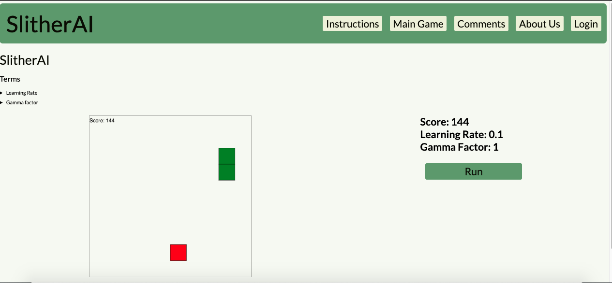

# SlitherAI

## Description

SlitherAI is a single page web application built using the MERN stack, which showcases an implementation of Deep Q Network (DQN) Reinforcement Learning. The project utilizes qTables to automate the classic Snake Game, and to enable the reinforcement learning algorithm to learn and improve its gameplay over time. In addition to showcasing the DQN algorithm, this project also demonstrates proficiency with web development technologies like MongoDB, Express.js, React, and Node.js.

## Installation

N/A

## Usage

To use the SlitherAI application, it can be accessed through its hosted website. Users can interact with the Run button in the Main Game tab to start and observe the gameplay. The application is meant to serve as an example of how DQN Reinforcement Learning can be applied to a classic game like Snake, and as a starting point for building more complex RL agents for other games and environments.
## ScreenShot

## Deployment

The SlitherAI application is deployed on the Heroku cloud platform, which provides a simple and convenient way to deploy, manage, and scale web applications.

https://slither2.herokuapp.com/

## License

MIT License

Copyright (c) 2022 peckham4563

Permission is hereby granted, free of charge, to any person obtaining a copy
of this software and associated documentation files (the "Software"), to deal
in the Software without restriction, including without limitation the rights
to use, copy, modify, merge, publish, distribute, sublicense, and/or sell
copies of the Software, and to permit persons to whom the Software is
furnished to do so, subject to the following conditions:

The above copyright notice and this permission notice shall be included in all
copies or substantial portions of the Software.

THE SOFTWARE IS PROVIDED "AS IS", WITHOUT WARRANTY OF ANY KIND, EXPRESS OR
IMPLIED, INCLUDING BUT NOT LIMITED TO THE WARRANTIES OF MERCHANTABILITY,
FITNESS FOR A PARTICULAR PURPOSE AND NONINFRINGEMENT. IN NO EVENT SHALL THE
AUTHORS OR COPYRIGHT HOLDERS BE LIABLE FOR ANY CLAIM, DAMAGES OR OTHER
LIABILITY, WHETHER IN AN ACTION OF CONTRACT, TORT OR OTHERWISE, ARISING FROM,
OUT OF OR IN CONNECTION WITH THE SOFTWARE OR THE USE OR OTHER DEALINGS IN THE
SOFTWARE.
